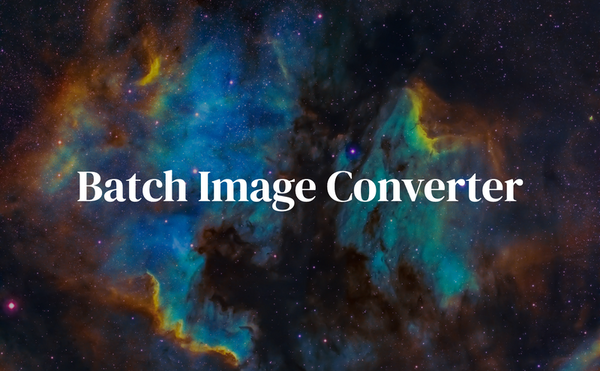

<h1 align="center">BIMGC</h1>

<p align="center">
<a href="https://bimgc.codewithshin.com/" rel="nofollow">Batch Image Converter</a>
</p>

<p align="center">
<a href="https://github.com/sponsors/shinokada" target="_blank"></a>
<a href="https://developer.mozilla.org/en-US/docs/Web/Progressive_web_apps"></a>
<a href="https://www.npmjs.com/package/bimgc" rel="nofollow" target="_blank"></a>
<a href="https://twitter.com/shinokada" rel="nofollow" target="_blank"></a>
<a href="https://opensource.org/licenses/MIT" rel="nofollow" target="_blank"></a>
<a href="https://www.npmjs.com/package/bimgc" rel="nofollow" target="_blank"></a>
</p>

<p align="center">
<picture>
  
</picture>
</p>

A CLI tool for converting PNG and JPG images to AVIF and WebP format with various sizes and saves them in a specified output directory. The output images are named based on the input file and include information about their size and format.

It is recommended to use this script in conjunction with [imgtaggen](https://imgtaggen.codewithshin.com/).

## Installation

```bash
npm i -g bimgc
bimgc --version
bimgc --help
cd path/to/your/project
```
## Usages

```bash
bimgc public/images/bimgc.png -o public/images 
```

This will convert `public/images/bimgc.png` to the `public/images` directory. The following images will be created.

```txt
bimgc-100.avif bimgc-200.avif bimgc-400.avif bimgc-800.avif 
bimgc-100.png  bimgc-200.png  bimgc-400.png  bimgc-800.png
bimgc-100.webp bimgc-200.webp bimgc-400.webp bimgc-800.webp
```

## Size

The default output sizes are 100, 200, 400, and 800. To specify a different set of output sizes, use the `-s` or `--sizes` option.

```bash
bimgc public/images/bimgc.png -s 100 200 -o public/images
```

## Format

The default formats are avif and webp. To specify a different set of output format, use `-f` or `--format` option.

```bash
public/images/bimgc.png -o public/images -f avif
```

## Output directory

The default output directory is your working directory. To specify a different output directory, use `-o` or `--outputdir` option.

```bash
public/images/bimgc.png -s 100 200 -o public/images
```

## Use this with imgtaggen

[imgtaggen](https://imgtaggen.codewithshin.com/) is a CLI tool for generating a responsive image tag with support for AVIF and WebP formats. It will also calculate image ratio.

Use `bimgc` in conjunction with `imgtaggen`.

## PWA: Fast & Offline

The [docs website]() can be downloaded and installed on your device for offline access as a Progressive Web App.

To install a PWA, look for the "Add to Home Screen" option in the browser's menu or settings. On most mobile devices, this option can be found by visiting the website, then selecting the "Options" or "Menu" button in the browser, and looking for the "Add to Home Screen" option. On some desktop browsers, right-click on the page and select "Install".